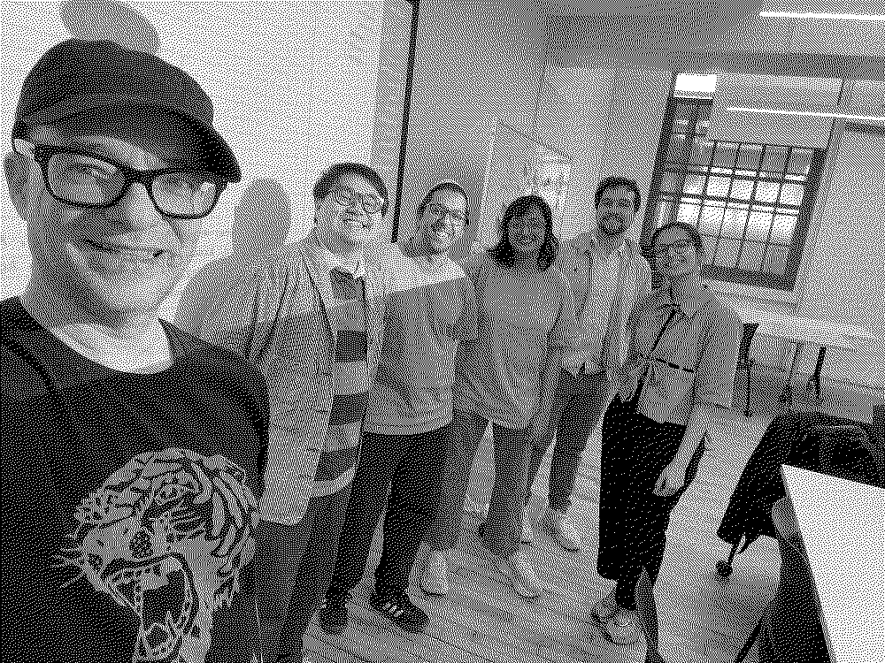

Critical Potluck is a casual peer-learning group for designers, artists, creative technologists, writers, researchers, and teachers who want to slow down and think critically about AI together.

Like a potluck: everyone brings something. We will first map out all our curiosities, worries, and knowledge; decide on the structure and format of the group together; and then each host a session and facilitate discussions around a topic of our choice. The goal is to create a space where we can learn, unlearn, teach, design, make art, and share ideas about how we want to navigate all of this together.

Read [Some Thoughts on AI & This Group](#munus-apr-11) for the full backstory.

---

## Next Session

**Session 1** — 5/9 Saturday 2:00–4:30pm
Munus Shih on Pedagogy

Details coming soon.

---

## Contribute

This site is a shared writing space. Everything lives in markdown files in the `content/` folder of the [GitHub repo](https://github.com/munusshih/critical-ai-potluck).

- To add a new page, create a new markdown file in the `content/` folder
- Later add the page to the nav in `index.html`:

```html
<li><a href="#markdown-filename">markdown filename</a></li>
```

- If you want to add custom CSS for your page, create a new CSS file in the `styles/` folder and link it in the front matter of your markdown file:

```markdown
css: styles/your-page.css
```

- If you want to add custom JS for your page, create a new JS file in the `scripts/` folder and link it in the front matter of your markdown file:

```markdown
js: scripts/your-page.js
```

- If you want a nav item that opens a PDF while keeping the nav visible, use a hash like this:

```html
<li><a href="#pdf=assets/your-file.pdf">your PDF title</a></li>
```

Checkout [template.md](./template.md) for a sample markdown file with all the features you can use.

---

## Help Wanted!

There are other things that need to be done beyond writing content! If you want to contribute but don't know where to start, here are some ideas:

- [ ] An arena board for sending resources
- [ ] Should people be able to note take?
- [ ] CSS/design improvements (polish this!)
- [ ] Anything else you can think of!
