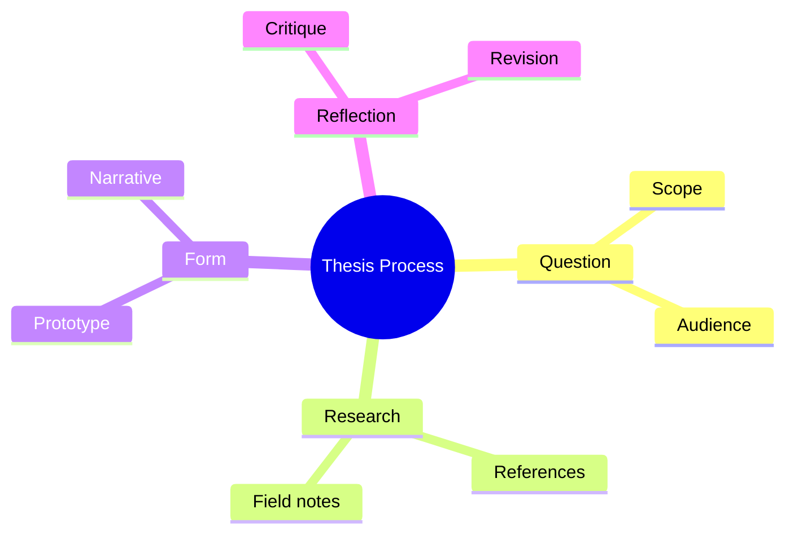

5-minute presentation for prospective students.

## Who I Am

<section class="hero-moment" data-theme="sage">
	<p class="eyebrow">Slide 1 · 45 sec</p>
	<h3>Thesis advising for ambitious, reflective work</h3>
	<p>I help students build projects that are conceptually sharp, visually persuasive, and socially situated.</p>
</section>

- Name: Munus Shih
- Role: Artist, educator, and creative technologist
- Focus: Critical, reflective, and experimental practice


## My Research and Practice

<section class="hero-moment" data-theme="sand">
	<p class="eyebrow">Slide 2 · 45 sec</p>
	<h3>Research that moves between critique and making</h3>
	<p>My practice combines writing, prototyping, and public presentation as one loop.</p>
</section>

- Themes: pedagogy, critical technology, design as inquiry, collaborative learning
- Methods: making, writing, critique, prototyping, and public-facing outcomes
- Values: ethics, context, care, and formal experimentation




## What I Do in Thesis Class

<section class="hero-moment" data-theme="rust">
	<p class="eyebrow">Slide 3 · 60 sec</p>
	<h3>From fuzzy idea to coherent thesis</h3>
	<p>We build momentum through checkpoints, feedback cycles, and clear decisions.</p>
</section>

- Help you define a clear thesis question and scope
- Support research methods (references, interviews, field/context research)
- Guide iteration from concept to form (prototype, narrative, and presentation)
- Provide structured feedback and checkpoints
- Coach articulation: how to explain your work to different audiences


## How I Advise

<section class="hero-moment" data-theme="ink">
	<p class="eyebrow">Slide 4 · 45 sec</p>
	<h3>Direct, structured, and care-forward</h3>
	<p>I ask hard questions while giving practical next steps every week.</p>
</section>

- I ask precise questions and push for conceptual clarity
- I support risk-taking, but with strong structure and milestones
- I give direct feedback with care
- I help you connect idea, process, and outcome

## Why Choose Me

<section class="hero-moment" data-theme="sage">
	<p class="eyebrow">Slide 5 · 45 sec</p>
	<h3>Critical depth plus practical execution</h3>
	<p>Ideal for interdisciplinary and experimental thesis directions that still need strong delivery.</p>
</section>

- You want both critical depth and practical execution
- You are interested in experimental or interdisciplinary thesis formats
- You want accountability and regular momentum
- You are open to iteration and critique-driven growth


## Is This a Good Fit?

<section class="two-col-pitch">
	<article>
		<h3>Great Fit If You Are</h3>
		<ul>
			<li>Curious and self-motivated</li>
			<li>Willing to revise and refine repeatedly</li>
			<li>Ready to situate your work in social, cultural, and ethical context</li>
			<li>Interested in developing a clear voice and point of view</li>
		</ul>
	</article>
	<article>
		<h3>Less Ideal If You Want</h3>
		<ul>
			<li>Minimal feedback and fully hands-off advising</li>
			<li>A purely style-first thesis without conceptual framing</li>
			<li>Last-minute process with no iterative development</li>
		</ul>
	</article>
</section>

## Interactive: Build Your Thesis Profile (30 sec)

Use the toggles to see the advising style that best matches your current stage.

<section class="interactive-panel" id="thesis-profile-panel">
	<label><input type="checkbox" data-trait="research"> I want stronger research framing</label>
	<label><input type="checkbox" data-trait="experimentation"> I want to push experimental formats</label>
	<label><input type="checkbox" data-trait="accountability"> I need weekly accountability</label>
	<p class="interactive-result" id="thesis-profile-result">Select at least one option.</p>
</section>

## Interactive: Motion Sketch (30 sec)

```p5.js
let t = 0;

p.setup = function () {
	p.createCanvas(900, 280);
	p.noFill();
	p.strokeWeight(2);
};

p.draw = function () {
	p.background(252, 248, 238);
	for (let i = 0; i < 9; i++) {
		const y = 20 + i * 30;
		const hue = 30 + i * 12;
		p.stroke(90 + i * 14, 60 + i * 8, hue);
		p.beginShape();
		for (let x = 0; x <= p.width; x += 18) {
			const wave = p.sin(x * 0.015 + t + i * 0.55) * (9 + i * 1.3);
			p.curveVertex(x, y + wave);
		}
		p.endShape();
	}
	t += 0.02;
};
```

## Closing and Invitation

<section class="hero-moment" data-theme="sand">
	<p class="eyebrow">Final Slide · 30 sec</p>
	<h3>Bring your interests, questions, and uncertainty</h3>
	<p>We can build a thesis process that is both ambitious and grounded.</p>
</section>

- If this sounds aligned, I would love to work with you
- We can shape a thesis process that is both ambitious and grounded


Thank you.
