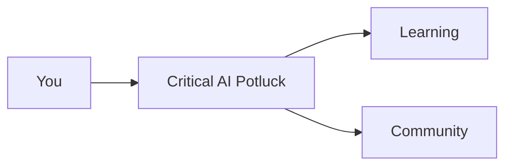

Regular markdown content. The front matter above renders:

- `title` → `<h1>` at the top, also sets the browser tab
- `date` + `author` → plain `<p>` underneath
- `css` → loads a per-page stylesheet

---

## p5.js sketch

Wrap your sketch in `new p5(p => { ... })`. It renders into an inline canvas.

```p5.js
  p.setup = () => p.createCanvas(400, 200);
  p.draw = () => {
    p.background(0);
    p.fill(255);
    p.ellipse(p.mouseX, p.mouseY, 40, 40);
  };
```

```js
p.setup = () => p.createCanvas(400, 200);
p.draw = () => {
  p.background(0);
  p.fill(255);
  p.ellipse(p.mouseX, p.mouseY, 40, 40);
};
```

---

## Mermaid diagram



---

## Syntax-highlighted code

Every code block gets a **copy** button on hover automatically.

```python
def greet(name):
    return f"hello, {name}"
```

---

## Table

| Name | Offer | Request |
| ---- | ----- | ------- |
|      |       |         |

---

## Blockquote

> This is a blockquote. You can use it for quotes, or just to highlight something important.
>
> It can also be used for the "offer/request" section in the potluck notes.

---

## Links

[Google](https://www.google.com)

---

## Images


---

## Lists

- Item 1
- Item 2
- Item 3
- Nested item
  - Nested item 1
  - Nested item 2
  - Nested item 3

---

### iframe

<iframe width="560" height="315" src="https://www.youtube.com/embed/dQw4w9WgXcQ" title="YouTube video player" frameborder="0" allowfullscreen></iframe>
